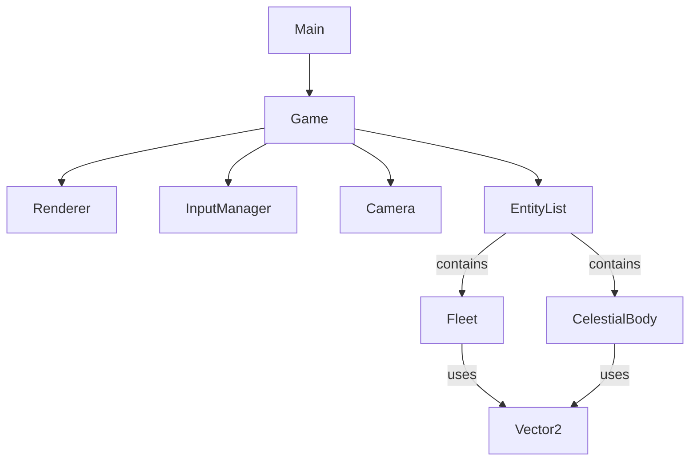

# Документация разработки VoidTactics

## 1. Стек технологий
*   **Язык**: TypeScript (Строгая типизация для надежности).
*   **Сборщик**: Vite (Быстрый старт, HMR).
*   **Рендеринг**: HTML5 Canvas API (Максимальная производительность для 2D, нативный контроль).
*   **Платформа**: Веб-браузер (PC/Mobile). PWA (в планах).

## 2. Архитектура проекта
Проект строится на модульной Объектно-Ориентированной Архитектуре (OOP) с элементами ECS (в будущем для оптимизации).

### Основные модули
*   **Core**:
    *   `Game`: Главный контроллер. Управляет игровым циклом (`loop`), обновлением (`update`) и отрисовкой (`draw`). Владеет списком сущностей.
    *   `InputManager`: Абстрагирует ввод. Унифицирует Mouse и Touch события в единый интерфейс (позиция курсора, клики, жесты).
*   **Renderer**:
    *   `Renderer`: Обертка над `CanvasRenderingContext2D`. Отвечает за ресайз окна, DPI (Retina), очистку кадра.
    *   `Camera`: Управляет "окном" в игровой мир. Преобразует координаты World <-> Screen. Поддерживает слежение за целью и зум.
*   **Entities (Сущности)**:
    *   `Entity` (Abstract): Базовый класс для всех объектов. Имеет позицию (`Vector2`), методы `update(dt)` и `draw(ctx, camera)`.
    *   `Fleet`: Игрок или AI. Реализует физику перемещения (инерция, ускорение).
    *   `CelestialBody`: Планеты, Звезды, Астероиды. Реализует освещение (тени относительно солнца).
*   **Utils**:
    *   `Vector2`: Математика векторов (сложение, вычитание, нормализация) для физики.

### Схема взаимодействия (Текущая)

### Принципы (Refactoring Goals)
*   **Избегание Хардкода**: Сейчас инициализация мира (`initWorld`) находится внутри `Game.ts`. В планах вынести это в `SceneManager` или `LevelLoader`.
*   **Конфигурация**: Параметры кораблей и планет должны загружаться из JSON/Config файлов, а не прописываться в коде.

## 3. Текущий статус (Реализовано)
*   [x] **Игровой движок**: Loop, Time delta, Canvas Setup.
*   [x] **Камера**: Плавное слежение (Lerp), зум (пока фиксированный).
*   [x] **Управление**: Touch/Mouse клик для движения.
*   [x] **Физика флота**: Ускорение, инерция, дрифт (Drift).
*   [x] **Визуал Маркера**: Animated Bubble Target.
*   [x] **Космос**:
    *   Звезда (Sol) с шейдерным свечением.
    *   Планеты с динамическими тенями (Day/Night cycle) зависящими от положения Солнца.
    *   Фон (Space Background).
    *   Астероиды и станции.

## 4. План разработки (Roadmap)

### Этап 2: Интерактивность и UI (В работе)
1.  **Selection System**:
    *   Реализовать Raycasting (проверку клика по объектам).
    *   Выделение планеты/корабля в таргет.
2.  **HUD (Интерфейс)**:
    *   Показывать имя и статус выделенного объекта.
    *   Кнопка "Dock" (Пристыковаться) при сближении с планетой.
3.  **Орбитальная механика**:
    *   Заставить планеты двигаться по орбитам (реалистично или упрощенно).

### Этап 3: Геймплей и Экономика
1.  **Инвентарь и Ресурсы**:
    *   Fuel (Топливо), Supplies (Припасы).
    *   Торговля на станциях (UI Модальные окна).
2.  **Генерация Систем**:
    *   Процедурная генерация звездных систем (JSON data).
    *   Переход межу системами (Hyperjump).

### Этап 4: Боевая система
1.  **Оружие**: Слоты на корабле, снаряды (Projectiles).
2.  **AI**: Поведение врагов (Orbit, Chase, Attack).
3.  **Damage Model**: Щиты, Броня, Структура (как в Starsector).
