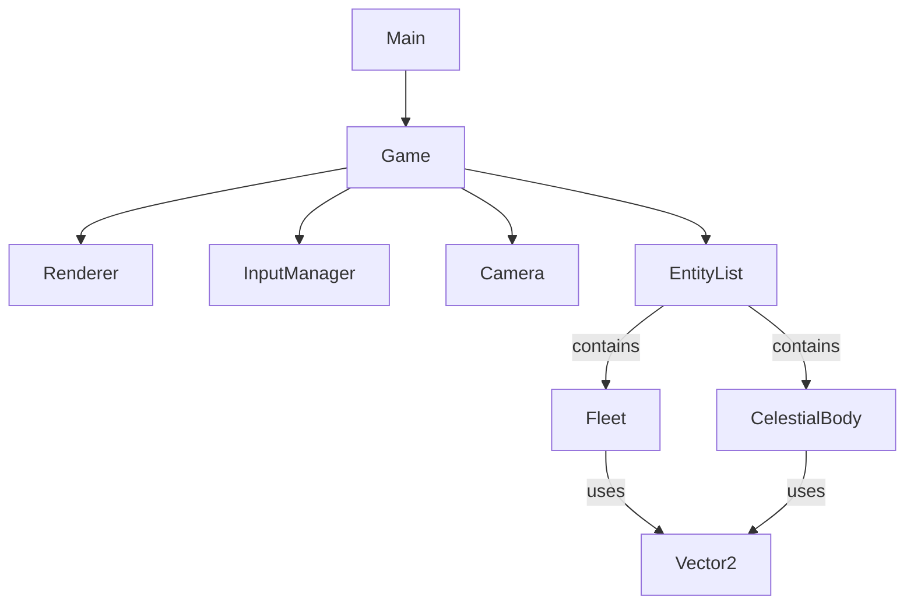

# VoidTactics Development Documentation

## 1. Technology Stack
*   **Language**: TypeScript (Strict typing for reliability).
*   **Bundler**: Vite (Fast startup, HMR).
*   **Rendering**: HTML5 Canvas API (Maximum performance for 2D, native control).
*   **Platform**: Web browser (PC/Mobile). PWA (planned).

## 2. Project Architecture
The project is built on a modular Object-Oriented Architecture (OOP) with elements of ECS (for future optimization).

### Main Modules
*   **Core**:
    *   `Game`: Main controller. Manages the game loop (`loop`), updates (`update`) and rendering (`draw`). Owns the list of entities.
    *   `InputManager`: Abstracts input. Unifies Mouse and Touch events into a single interface (cursor position, clicks, gestures).
*   **Renderer**:
    *   `Renderer`: Wrapper over `CanvasRenderingContext2D`. Handles window resize, DPI (Retina), frame clearing.
    *   `Camera`: Manages the "window" into the game world. Transforms coordinates World <-> Screen. Supports target tracking and zoom.
*   **Entities**:
    *   `Entity` (Abstract): Base class for all objects. Has position (`Vector2`), methods `update(dt)` and `draw(ctx, camera)`.
    *   `Fleet`: Player or AI. Implements movement physics (inertia, acceleration).
    *   `CelestialBody`: Planets, Stars, Asteroids. Implements lighting (shadows relative to the sun).
*   **Utils**:
    *   `Vector2`: Vector math (addition, subtraction, normalization) for physics.

### Interaction Diagram (Current)

### Principles (Refactoring Goals)
*   **Avoid Hardcoding**: Currently world initialization (`initWorld`) is inside `Game.ts`. Plans to extract this to `SceneManager` or `LevelLoader`.
*   **Configuration**: Ship and planet parameters should be loaded from JSON/Config files, not hardcoded in code.

## 3. Current Status (Implemented)
*   [x] **Game Engine**: Loop, Time delta, Canvas Setup.
*   [x] **Camera**: Smooth tracking (Lerp), zoom (mouse wheel/pinch).
*   [x] **Controls**: Touch/Mouse click for movement, double-click in inspection mode.
*   [x] **Fleet Physics**: Acceleration, inertia, drift (Drift).
*   [x] **Marker Visual**: Animated Bubble Target.
*   [x] **Space**:
*   [x] Star (Sol) with shader glow.
*   [x] Planets with dynamic shadows (Day/Night cycle) depending on Sun position.
*   [x] Background (Space Background).
*   [x] Asteroids
*   [x] **Selection System** (click detection on objects).
*   [x] **Planet/Ship Selection** - show information with action buttons.
*   [x] **Fleet Interaction System**:
    *   "Approach" mode - following selected fleet at distance.
    *   Visual indication (dashed line) when following.
    *   Contact dialog when approaching (Communicate/Attack/Cancel).
    *   Basic battle screen (placeholder).

## 4. Development Plan (Roadmap)

### Phase 2: Interactivity and UI (In Progress)

2.  **HUD (Interface)**:
    *   "Dock" button when approaching a planet.
3.  **Orbital Mechanics**:
    *   Make planets move in orbits (realistic or simplified).

### Phase 3: Gameplay and Economy
1.  **Inventory and Resources**:
    *   Fuel, Supplies.
    *   Trading at stations (UI Modal windows).
2.  **System Generation**:
    *   Procedural generation of star systems (JSON data).
    *   Transitions between systems (Hyperjump).
3.  **Communications System**:
    *   Dialogs with NPC fleets.
    *   Trading and quests through communications.

### Phase 4: Combat System
1.  **Weapons**: Ship slots, projectiles (Projectiles).
2.  **AI**: Enemy behavior (Orbit, Chase, Attack).
3.  **Damage Model**: Shields, Armor, Structure (like in Starsector).
4.  **Detailed Battle Screen**: Weapon control, shields, maneuvers.

## 5. Game Systems
*   **Ability System**:
    *   Consumables: Afterburner, Bubble, Cloak, Warp Mine.
    *   Charges management ($50 per unit at Terra, max 10).
    *   Ability panel with cooldowns and charge badges.
*   **Tactical Entities**:
    *   `WarpMine`: Proximity trigger, explosion damage, and short-stasis effect (3 damage + 5% size).
    *   `BubbleZone`: Area-of-effect stasis field that slows ships by 90%.
